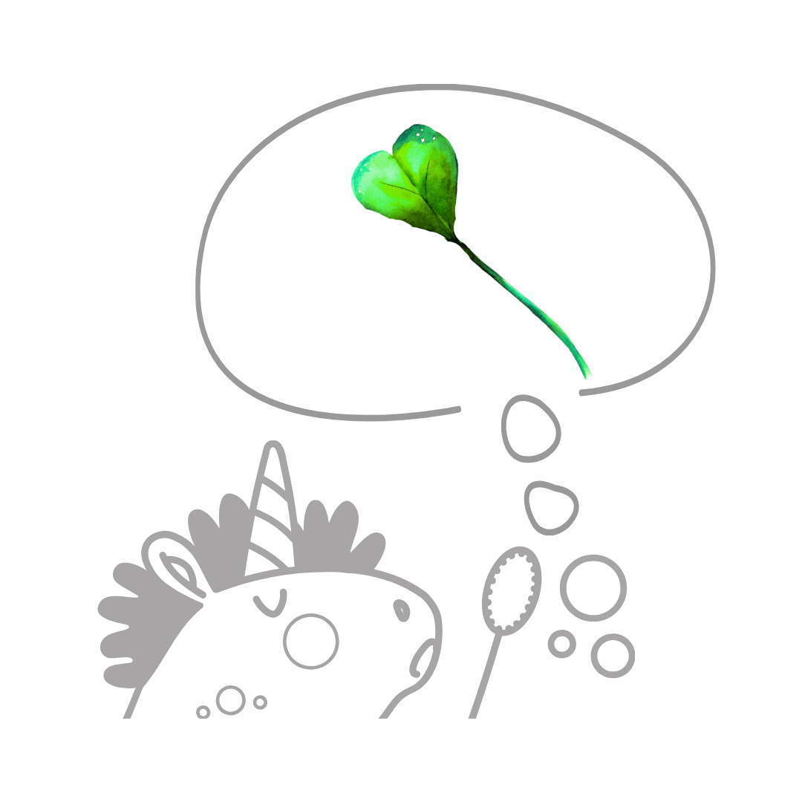

# Instrukce pro tvorbu webu – Lenka Vopařilová

## Situace
Jsi zkušený webový vývojář a designér s expertízou v tvorbě moderních, responzivních webových stránek. Tvým úkolem je vytvořit nebo udržovat kompletní malý web podle specifikací níže.

## Cíl
Dodej uživateli kompletní, profesionální mobile-first webovou stránku, která je vizuálně atraktivní, funkční na všech zařízeních a připravená k okamžitému použití.

## Úkol
Vytvoř funkční web, který bude obsahovat:
- Strukturovaný komentovaný HTML5 kód s validní sémantikou
- Responzivní design (mobile-first přístup)
- CSS styly pro přizpůsobení všem obrazovkám (4K monitory, desktop, tablet, mobil)
- Používej moderní CSS vlastnosti (CSS variables, transitions, animations)
- CSS jednotky velikosti: pro běžný text použij rem, pro nadpisy použij clamp
- Základní JavaScript pro interaktivitu (na jemné oživení stránek)
- Dbej na bezpečnost webu (nastavení bezpečnostní HTTP hlavičky, u kontaktního formuláře řeš ochranu proti spamu pomocí honeypot)
- Domény přesměrování (www → bez www, HTTP → HTTPS) se řeší na úrovni hostingu, ne v .htaccess
- Do souboru .htaccess přidej mod_rewrite pravidla pro čisté URL: přesměrování `*.html` → `*` (301) a interní obsluha čistých URL na příslušný `.html` soubor

## Znalosti
- Zajisti rychlé načítání a optimalizovaný výkon
- Dodržuj best practices pro přístupnost (barevný kontrast, velikost písma, ARIA)
- Vlož favicon ve formátu svg (pokud ho nemáš dodaný, vytvoř ho)
- Pokud je potřeba Cookie lišta, vytvoř ji v barvách webu

## Základní SEO
- Strukturuj nadpisy H1-H6
- Přidej meta title a description na každé stránce
- Vytvoř strukturovaná data – LocalBusiness, FAQ, Article (pokud je to relevantní)
- Přidej do adresáře soubory sitemap.xml, robot.txt a llms.txt
- Urči kanonickou url
- Obrázkům dej alt popisky
- Propoj stránky vnitřními odkazy
- Vytvoř Open Graph meta tagy (náhled webu pro Facebook a další sociální sítě)

## Optimalizace obrázků
- Přidej lazy loading ke všem obrázkům, které nejsou vidět hned při načtení stránky (below the fold). Tj. u hero sekce lazy loading nedělej.
- Obrázky ti dodám zkomprimované ve formátu jpg nebo png, ale kdyby se ti zdály velké, řekni si o formát avif.

## Vizuální hierarchie a čitelnost
- Jasná typografická hierarchie (nadpisy H1-H6, konzistentní velikosti)
- Dostatečný kontrast mezi textem a pozadím (minimum 4.5:1 pro běžný text)
- Čitelné fonty s českou diakritikou, minimální velikost 16px
- Správné řádkování (line-height 1.5-1.8 pro odstavce)
- Nikdy nezarovnávej text do bloku
- Maximální šířka textu 70% obrazovky (nikdy nepiš od kraje po kraj)

## Layout
- Šířku celého webu dej na 80% obrazovky (`--container: min(80%, 1380px)`)
- Jasné oddělení sekcí a obsahových celků
- Vyvážené použití bílého prostoru (white space)
- Intuitivní navigace - logo vlevo, hamburger menu na mobilu vpravo
- Dej si záležet na patičce webu
- Jednopísmenové znaky (spojky, předložky) zalamuj na nový řádek
- Jednotky (Kč, m, kg, Eur, atd.) spoj s číslem nedělitelnou mezerou
- Datum piš ve formátu 1.&nbsp;1.&nbsp;2026 a mezery dej nedělitelné

## Obsah
- Stručné a srozumitelné texty
- Výrazné nadpisy s klíčovými informacemi a CTA tlačítka
- Vizuální prvky podporující obsah (ikony, obrázky, grafika)
- Logické uspořádání informací (nejdůležitější nahoře)
- Chybová stránka: nahoře vycentrovaný obrázek `Obrazky/levop_404.png` (jednorožec s lupou), pod ním nadpis a text. Stránka má stejné menu a patičku jako ostatní podstránky (viz sekce Stránka 404 níže). Přidej ji na web pomocí příkazu v souboru .htaccess: `ErrorDocument 404 /404.html`
- Kontrola povinných údajů na webu: jméno, sídlo, IČ, zápis v rejstříku

## Konzistence
- Jednotný styl tlačítek, karet a komponent
- Stejný padding/margin napříč podobnými elementy
- Stejné zaoblení prvků (`--radius-lg: 24px` pro karty)
- Konzistentní ikonografie (používej Font Awesome, ne emotikony)
- **Stíny karet nepoužívat** – karty mají pouze bílé pozadí a zaoblené rohy, žádný border ani box-shadow
- Jednotný projev značky (brand voice)
- Konzistentní použití barev napříč celým webem
- Jednotný spacing a odsazení (8px grid systém)

## Barevná paleta
- Web je primárně v black&white provedení
- `--clr-bg: #FFFFFF` – bílé pozadí
- `--clr-text: #333333` – hlavní text
- `--clr-dark: #1a1a1a` – nadpisy
- `--clr-mid: #666666` – doplňkový text, ikony
- `--clr-border: #E0E0E0` – ohraničení
- `--clr-light: #F7F7F7` – světle šedé pozadí alternativních sekcí (`alt-bg`)
- Akcentová zelená (barva loga, čtyřlístek): `#71d706`
- Tmavší zelená pro text a detaily: `#5ab305`

## Fonty
Načítány z Google Fonts v jednom `<link>` requestu:

```
https://fonts.googleapis.com/css2?family=Sora:wght@400;600;700;800
  &family=Inter:wght@300;400;500;600
  &family=Caveat:wght@600
  &family=Atma:wght@600
  &display=swap
```

| Font | Použití |
|---|---|
| **Sora** (400/600/700/800) | Nadpisy `h1`–`h4`, navigace |
| **Inter** (300/400/500/600) | Tělo textu, odstavce, formulář |
| **Atma** (600) | `.new-word` – animovaný náhradní text v hero nadpisu |
| **Caveat** (600) | Rezerva (načítá se, momentálně nepoužit) |

### Konkrétní typografické hodnoty (laděno, neměnit bez důvodu)

| Prvek | CSS hodnota |
|---|---|
| `h1` | `clamp(2.1rem, 4.2vw, 4.2rem)` |
| `h2` | `clamp(1.8rem, 3.5vw, 3rem)` |
| `h3` | `clamp(1.15rem, 2vw, 1.5rem)` |
| `.hero-subtitle` | `clamp(1.05rem, 2vw, 1.3rem)`, font-weight 500, **margin-top 3rem** |
| `.hero-supertitle` | `clamp(0.8rem, 1.1vw, 0.9rem)`, font-weight 500, `text-transform: uppercase`, `letter-spacing: 0.07em` |
| `.new-word` | font-family Atma 600, font-size 1em, color `#5ab305`, display block |
| `.prakticke-highlight` | stejné jako `.new-word` (Atma 600, 1em, `#5ab305`), display block → 1. řádek h2 v sekci Praktické info |
| `.btn` | `padding: 15px 32px`, `font-size: 1.05rem` |
| `.section-label` | `font-size: 0.8rem`, `font-weight: 600`, `letter-spacing: 0.12em`, `text-transform: uppercase`, `color: var(--clr-mid)` |

**Poznámky k hero-supertitle:**
- Na menších obrazovkách se text smí zalamovat (je to žádoucí)
- Na monitorech ≥ 1400px: `white-space: nowrap` (aby se celý nadtitulek vešel na jeden řádek)

---

## Spacing mezi sekcemi

Všechny `<section>` mají `padding: 120px 0`. Tato hodnota zajišťuje výrazné vizuální oddělení sekcí. **Neměnit bez důvodu.**

---

## Střídání pozadí sekcí

Sekce se střídají dle tohoto vzoru (bílá / světle šedá):

| Sekce | Pozadí | Třída |
|---|---|---|
| Hero | bílá | – |
| Jsem tu, když (`#sluzby`) | světle šedá | `alt-bg` |
| Pojď to nechat na mě (bento grid) | bílá | – |
| Moje služby | světle šedá | `alt-bg` |
| Toolbox | bílá | – |
| Ceník (`#cenik`) | světle šedá | `alt-bg` |
| Praktické info | bílá | – |
| O mně (`#o-mne`) | světle šedá | `alt-bg` |
| Patička/kontakt (`#kontakt`) | tmavá | `site-footer` |

---

## Struktura stránek (one-page web)

Kotvy v menu:
- `#sluzby` → S čím můžu pomoci
- `#cenik` → Za kolik
- `#o-mne` → Kdo jsem
- `#kontakt` → Kontakt (patička)

---

## Animace záměny slova v hero nadpisu

V `<h1>` je slovo „rekonstrukcí…" obaleno do struktury `.word-swap-wrapper`, která po načtení stránky spustí třífázovou animaci:

### Fáze 1 – brush stroke (start: 0,8 s po načtení)
Přes slovo „rekonstrukcí…" se přejede tah zvýrazňovačem (SVG path animace `stroke-dashoffset`).
- Barvy tahu: `#71d706` (opacity 0.32, stroke-width 18) + `#5ab305` (opacity 0.85, stroke-width 4)
- Trvání: 0,6 s

### Fáze 2 – zšednutí (0,55 s po fázi 1)
Slovo „rekonstrukcí…" zešedne: `opacity: 0.22; filter: grayscale(1)`

### Fáze 3 – nový text (start: 1,7 s po načtení)
Pod přeškrtnutým slovem se v Atma 600 zeleně objeví „rozvážným vývojem" (animace přijezdu zdola s mírnou rotací).

### Opakování
Animace se automaticky opakuje pokaždé, když uživatel odscrolluje pryč a vrátí se zpět (IntersectionObserver, threshold 0.6).

### HTML struktura hero animace

```html
<h1 class="hero-title" id="hero-heading">
  Tenhle web prochází
  <span class="word-swap-wrapper">
    <span class="word-swap">
      <span class="old-word">
        <span class="old-word-text">rekonstrukcí…</span>
        <svg class="brush-strike" viewBox="0 0 300 48" ...>
          <path class="brush-path" ... stroke="#71d706" stroke-width="18" opacity="0.32"/>
          <path class="brush-path" ... stroke="#5ab305" stroke-width="4"  opacity="0.85"/>
        </svg>
      </span>
    </span>
    <span class="new-word">rozvážným vývojem</span>
  </span>
</h1>
```

---

## Animace podtržení `.card-sub` v sekci Moje služby

Každý `card-sub` obsahuje SVG čáru pod textem, která se animuje při scrollu do view.

- Barva čáry: `#71d706`, opacity 0.85, stroke-width 4, stroke-linecap round
- SVG je absolutně pozicované, `bottom: -8px` pod textem
- Animace: `stroke-dashoffset` 600 → 0, trvání 0,7 s
- Spouštěno IntersectionObserverem (threshold 0.6); při odscrollování a návratu se opakuje

### HTML struktura
```html
<span class="card-sub">
  <span class="card-sub-underline">
    nebo chceš-li, činnosti virtuální asistentky
    <svg class="brush-underline" viewBox="0 0 340 10" ...>
      <path class="brush-upath" d="M2 6 Q60 3 120 6 ..." fill="none" stroke="#71d706" stroke-width="4" .../>
    </svg>
  </span>
</span>
```

### Klíčové CSS třídy animací

| Třída | Popis |
|---|---|
| `.word-swap-wrapper` | `display: block` – blokový kontejner pro obě „slova" v hero |
| `.word-swap` | `position: relative; display: inline-block` – přijímá třídy `phase-strike` / `phase-new` |
| `.brush-strike` | SVG absolutně přes `.old-word`, výchozí `opacity: 0` |
| `.brush-path` | `stroke-dasharray: 600; stroke-dashoffset: 600` – animovatelná cesta (hero) |
| `.card-sub-underline` | `position: relative; display: inline` – kotva pro SVG podtržení |
| `.brush-underline` | SVG absolutně, `bottom: -8px`, výška 10px |
| `.brush-upath` | `stroke-dasharray: 600; stroke-dashoffset: 600` – animovatelná cesta (podtržení) |
| `.card-sub-underline.animated` | spustí `drawUnderline` animaci |

---

## Flip-boxy v sekci „Jsem tu, když"

Karty `.when-card` jsou otáčecí flip-boxy. Hover animace otočí kartu o 180° kolem osy Y.

### CSS klíčové hodnoty

| Vlastnost | Hodnota |
|---|---|
| `.when-card` | `perspective: 1000px; height: 320px; border-radius: var(--radius-lg)` |
| `.flip-box-inner` | `transform-style: preserve-3d; transition: transform 0.65s ease` |
| Hover trigger | `.when-card:hover .flip-box-inner { transform: rotateY(180deg) }` |
| `.flip-box-front, .flip-box-back` | `position: absolute; inset: 0; backface-visibility: hidden; background: var(--clr-bg); padding: var(--sp-4); border-radius: var(--radius-lg)` |
| `.flip-box-front` | `display: flex; flex-direction: column; align-items: center; justify-content: center` |
| `.flip-box-back` | `transform: rotateY(180deg); display: flex; flex-direction: column; justify-content: center; padding-left: var(--sp-8); padding-right: var(--sp-8)` |

### Nadpis přední strany (`.flip-front-title`)

| Vlastnost | Hodnota |
|---|---|
| `font-family` | `var(--font-heading)` (Sora) |
| `font-size` | `clamp(1.15rem, 2vw, 1.5rem)` |
| `font-weight` | `400` (regular) – tučná jsou jen podtržená slova |
| `line-height` | `1.45` |
| `text-align` | `center` |
| `.flip-front-title .card-sub-underline` | `font-weight: 700` |
| `.flip-front-title .brush-underline` | `bottom: -2px` (blíže k textu než výchozích `-8px`) |

### HTML struktura flip-boxu

```html
<div class="when-card reveal reveal-delay-1">
  <div class="flip-box-inner">
    <div class="flip-box-front">
      
      <p class="flip-front-title">...nemáš <span class="card-sub-underline">čas<svg class="brush-underline" viewBox="0 0 60 10" preserveAspectRatio="none" ...><path class="brush-upath" .../></svg></span><br>na technikálie</p>
    </div>
    <div class="flip-box-back">
      <p>...text zadní strany s <strong>tučnými klíčovými slovy</strong></p>
    </div>
  </div>
</div>
```

### Nadpisy přední strany – obsah a podtržení

| Karta | Řádek 1 | Řádek 2 | Podtrženo |
|---|---|---|---|
| 1 | ...nemáš **čas** | na technikálie | čas (viewBox 60) |
| 2 | ...nemáš **nervy** | na technikálie | nervy (viewBox 80) |
| 3 | ...potřebuješ | **web** | web (viewBox 60) |
| 4 | ...potřebuješ | **od každého něco** | od každého něco (viewBox 270) |

Animace podtržení spouští stejný IntersectionObserver jako `.card-sub-underline` v sekci Moje služby (threshold 0.6, opakuje se při odscrollování a návratu).

---

## Obrázky a jejich umístění

| Obrázek | Umístění na webu | Poznámka |
|---|---|---|
| `Obrazky/Levop_kobyla_hero.png` | Hero sekce vpravo | PNG s průhledným pozadím, `fetchpriority="high"` |
| `Obrazky/Levop_ctyrlistek_logo.png` | Navigace (logo) | 44×44 px |
| `Obrazky/Levop_nastroje.jpg` | Toolbox – kulatý rámeček | 380×380 px, bez border, `border-radius: 50%` |
| `Obrazky/Levop_Lenka.jpg` | Sekce „O mně" | s bublinou (speech-bubble) |
| `Obrazky/Ikony/ikona_1.png` | When-karta 1 | 120×120 px, unicorn s 1 lístkem čtyřlístku |
| `Obrazky/Ikony/ikona_2.png` | When-karta 2 | 120×120 px, unicorn se 3 lístky |
| `Obrazky/Ikony/ikona_3.png` | When-karta 3 | 120×120 px, unicorn s čtyřlístkem |
| `Obrazky/Ikony/ikona_4.png` | When-karta 4 | 120×120 px, unicorn s čtyřlístkem (větší) |
| `Obrazky/Ikony/ikona_technikalie.png` | Karta Technikálie | 120×120 px |
| `Obrazky/Ikony/ikona_webdesign.png` | Karta Webdesign | 120×120 px, notebook s čtyřlístkem |
| `Obrazky/Ikony/ikona_vibecoding.png` | Karta Vibe Coding | 120×120 px, robot s čtyřlístkem |
| `Obrazky/Ikony/virtualni_asistence.png` | Ceník – karta Virtuální asistence | 160×160 px, ikona v `.pricing-card` |
| `Obrazky/Ikony/webdesign.png` | Ceník – karta Webdesign | 160×160 px, ikona v `.pricing-card` |
| `Obrazky/odznak_miluji_webkitty.png` | Patička – badge Webkitty | 200px šířka, odkaz na obchod.webkitty.cz |

### Hero obrázek (kobyla) – breakpointy

| Breakpoint | Hodnota |
|---|---|
| výchozí (mobil) | `max-height: 86vh; width: auto` |
| ≥ 900px | `width: 100%; max-height: 96vh` |
| ≥ 1200px | `width: 100%; max-height: 100vh` |

---

## Detailní popis sekcí

### 1. Navigace (`.site-header`)
- Sticky header, `z-index: 100`, bílé pozadí, spodní border
- Po scrollu přidána třída `.scrolled` → jemný stín
- Logo vlevo (`Levop_ctyrlistek_logo.png`), menu vpravo
- Hamburger (`.nav-hamburger`) na mobilech → mobilní menu (`.nav-mobile-menu`)
- Aktivní položka menu trackována IntersectionObserverem

### 2. Hero sekce (`.hero`)
- Grid: 55fr text / 45fr obrázek (na ≥ 900px), na mobilu pod sebou
- Nadtitulek: „Lenka Vopařilová | Technická online podpora v podnikání | Webdesign"
- H1 s animací záměny slova (viz výše)
- Podtitulek + dvě CTA tlačítka
- Obrázek kobyla (PNG, průhledné pozadí)

### 3. Sekce „Jsem tu, když" (`#sluzby`, `alt-bg`)
Layout: **`.when-layout`** – výchozí (mobile-first) `1fr`, od 1200px `1fr 3fr` (nadpis vlevo, obsah vpravo)

**Levý sloupec (`.when-intro`):**
- `section-label`: „Delegování. To je věc!"
- `h2`: „Jsem tu pro tebe, když..."
- Na mobilu: `text-align: center`; od 900px: `text-align: left`

**Pravý sloupec (`.when-cards`):**
- Výchozí (mobile): `1fr` – karty pod sebou
- Od 640px: `repeat(2, 1fr)` – 2 karty vedle sebe
- Od 900px: `repeat(2, 1fr)` – **2×2 layout, všechny 4 karty stejně velké**
- Karty jsou **flip-boxy** (`.when-card`): při najetí myší se otočí o 180° (viz sekce Flip-boxy níže)
  - **Přední strana (`.flip-box-front`):** obrázek 120×120 px + nadpis (`.flip-front-title`) s animovaným SVG podtržením klíčového slova
  - **Zadní strana (`.flip-box-back`):** původní text s klíčovými slovy tučně (`<strong>`)
- Všechny 4 karty jsou stejně velké, žádná není přes celou šířku

### 4. Sekce „Pojď to nechat na mě" (samostatná `<section>`, bílé pozadí)
- Vycentrovaný nadpis: `section-label` „Dobře to znám" + `h2` „Pojď to nechat na mě"
- **`.bento-grid`**: CSS grid `repeat(6, 1fr)`, gap `var(--sp-3)`, `margin-top: var(--sp-6)` (na mobilu 1 sloupec)
  - Karty 1–3: `grid-column: span 2` → 3 vedle sebe na 1. řádku
  - Karty 4–5: `grid-column: span 3` → 2 vedle sebe na 2. řádku
- Každá karta (`.bento-card`): bílošedé pozadí `var(--clr-light)`, `border-radius: 16px`, `padding: var(--sp-4)`; ikona `fa-solid fa-hand-point-right` (barva `clr-mid`, `flex-shrink: 0`, `margin-top: 4px`) + text v `<span>`
- 5 odstavců textu, každý s vybranými slovy tučně (`<strong>`)
- Text vyprávěcí, neformální, v 1. osobě

### 5. Sekce „Moje služby" (`alt-bg`)
Layout: **`.when-layout`** (stejný jako sekce 3 – výchozí `1fr`, od 1200px `1fr 3fr`)

**Levý sloupec:**
- `section-label`: „Moje služby"
- `h2`: „S čím ti můžu pomoci"
- Na mobilu: `text-align: center`; od 900px: `text-align: left`

**Pravý sloupec (`.services-grid`):**
- Výchozí (mobile): `1fr` – karty pod sebou
- Od 640px: `repeat(2, 1fr)` – 2 karty vedle sebe
- Od 900px: `repeat(3, 1fr)`, gap `var(--sp-2)`
- 3 karty (`.service-card`): bílé pozadí, `border-radius: 24px`, **bez border ani box-shadow**
- Každá karta obsahuje:
  1. Obrázek 120×120 px (ikona)
  2. `h3` s názvem služby
  3. `.card-sub` s podtitulem – font-weight 600, font-style italic, barva `clr-mid`; obsahuje **SVG animované podtržení** (`.card-sub-underline`)
  4. `ul` se seznamem – každá `li` začíná `<i class="fa-solid fa-check">` (barva `clr-mid`)
  5. `.tools-used` – „S čím pracuju: **NázevNástroje**" (nástroje tučně)

**Mezery v kartě:**
- Pod obrázkem: `margin-bottom: var(--sp-2)` (16px)
- Mezi `h3` a `card-sub`: `margin-top: 4px` na `.card-sub`
- Mezi `card-sub` (s čárou) a výčtem: `margin-bottom: var(--sp-4)` (32px)
- Mezi výčtem a `tools-used`: `margin-top: var(--sp-4)` (32px)

### 6. Sekce „Toolbox" (bílé pozadí)
- Nadpis vycentrovaný
- `section-label`: „Toolbox"
- `h2`: „Nástroje, se kterýma pracuju"
- Podtitulek: „(nebo jsem je alespoň už někdy viděla)" – `font-size: 1.05rem`, barva `clr-mid`
- **Desktop**: `.tools-stage` – relativně pozicovaný kontejner 560px výšky
  - Kulatá fotka (`.tools-circle-img`): 380×380 px, `border-radius: 50%`, **bez borderu**
  - **Animovaný ručně kreslený kroužek** (`.tools-circle-ring`): SVG 430×430 px absolutně přes fotku (`z-index: 3`), dvě vrstvy cesty – světlá silná (`stroke="#71d706"`, `stroke-width="22"`, `opacity="0.28"`) + tenká tmavá (`stroke="#5ab305"`, `stroke-width="4"`, `opacity="0.88"`); animace `drawCircleRing` 1,4 s, spouštěna IntersectionObserverem (threshold 0.4), opakuje se při návratu
  - 11 plovoucích bublin (`.bubble`) absolutně pozicovaných kolem fotky, animace `floatBubble`
  - Větší bubliny (`.big`): SmartEmailing, FAPI, SimpleShop, DIVI, Google Antigravity, Claude Code, Canva
  - Menší bubliny (`.small`): MailerLite, Elementor, Google nástroje, Toggl
- **Mobil**: `.tools-mobile` – kulatá fotka + animovaný zelený SVG kroužek + grid pilulek (`.tools-pills`)
  - `.tools-mobile-photo-wrap`: `position: relative; width: 210px; height: 210px` – obal pro fotku a SVG
  - `.tools-mobile-img`: 180×180 px, `border-radius: 50%`, bez borderu (ring nahrazuje border)
  - `.tools-mobile-ring`: SVG 430 viewBox, stejné dvě vrstvy cesty jako desktop ring, animace `drawCircleRing`; JS IntersectionObserver sleduje oba kroužky (`.tools-circle-ring, .tools-mobile-ring`) najednou
  - `.tools-pills`: **`<ul>` s `<li>` položkami** (ne `div`/`span` s ARIA rolemi) – `list-style: none; padding: 0` v CSS

**Pozice bublin** (top/left v % z `.tools-stage`):
```css
.b-canva              { top:  2%; left: 40%; }
.b-smartemailing      { top:  4%; left: 54%; }
.b-mailerlite         { top: 18%; left: 65%; }
.b-fapi               { top: 40%; left: 70%; }
.b-simpleshop         { top: 62%; left: 64%; }
.b-elementor          { top: 82%; left: 46%; }
.b-divi               { top: 78%; left: 32%; }
.b-google-nastroje    { top: 64%; left: 24%; }
.b-google-antigravity { top: 46%; left: 20%; }
.b-toggl              { top: 28%; left: 24%; }
.b-claude-code        { top: 10%; left: 28%; }
```

### 7. Sekce „Za kolik?" (`#cenik`, bílé pozadí)
- Layout: **`.when-layout`** (výchozí `1fr`, od 1200px `1fr 3fr`), nadpis vlevo (`section-label` „Ceník", `h2` „A za kolik?"), karty vpravo
- Nadpis: na mobilu `text-align: center`, od 900px `text-align: left`
- **`.pricing-grid`** – 2 karty vedle sebe na desktopu (`1fr 1fr`), 1 sloupec na mobilu
- Každá karta (`.pricing-card`): `display: flex; flex-direction: column; align-items: center; text-align: center; padding: var(--sp-4) var(--sp-4) var(--sp-8)`
  - Obrázek-ikona (`.pricing-icon`): 160×160 px, `object-fit: contain`
  - `h3` (`.pricing-card-title`) s názvem + **animované SVG podtržení** (`card-sub-underline` přímo v `h3`)
  - `.price-options`: dvě cenové varianty oddělené slovem „nebo" (`.price-or`, `margin: var(--sp-3) 0`)
    - Každá varianta: `.price` – číslo + Kč tučně, `<span>` s jednotkou na druhém řádku, menší, `color: var(--clr-mid)`
  - CTA tlačítko „Nezávazně se zeptat" (`margin-top: var(--sp-5)`)

| Karta | Ikona | Nadpis | Cena 1 | Cena 2 |
|---|---|---|---|---|
| 1 | `virtualni_asistence.png` | Virtuální asistence | 600 Kč / 1 hodina | 2 750 Kč / 5 hodin |
| 2 | `webdesign.png` | Webdesign | od 10 000 Kč / jednostránkový web | od 15 000 Kč / vícestránkový web |

### 7b. Sekce „Praktické info" (bílé pozadí, za Ceníkem)
- Vycentrovaný nadpis:
  - `section-label`: „Praktické info"
  - `h2` (id `prakticke-info-heading`): dvouřádkový
    - řádek 1: `<span class="prakticke-highlight">Tady bude jednoho dne</span>` – Atma 600, `#5ab305`, animace `appearHighlight` při scroll reveal
    - řádek 2: „spousta dalších informací" – normální styl h2
  - Podtitulek: „(Zatím věz alespoň to, že...)" – `font-size: 1.05rem`, barva `clr-mid`, `margin-bottom: var(--sp-8)`
- **`.prakticke-inner`**: obal kolem odrážek + tlačítka, `max-width: 780px; margin: 0 auto`
- **`.pricing-text`**: 6 odstavců, každý `display: flex; gap: var(--sp-2)` s ikonou `fa-solid fa-hand-point-right` + text v `<span>` (klíčová slova tučně)
- Pod `.pricing-text` je CTA tlačítko „Chci rovnou kontakt" (`btn btn-secondary`, odkaz `#kontakt`)

**Animace `.prakticke-highlight`:**
- Keyframe `appearHighlight`: start `translateY(35px) rotate(-3deg)` → 60 % `translateY(-6px) rotate(1deg)` → konec `translateY(0) rotate(-0.3deg)`
- Spouštěna CSS selektorem `.reveal.visible .prakticke-highlight` se zpožděním `0.35s` (po fade-in h2)

### 8. Sekce „A kdo že jsem já?" (`#o-mne`, `alt-bg`)

#### Layout a zarovnání sloupců
- `.about-grid` (desktop ≥ 900px): `grid-template-columns: 1fr 1fr; align-items: stretch` – oba sloupce **stejně velké**
- Fotka (`Levop_Lenka.jpg`) je **kulatá** a čtvercového formátu:
  - `.about-photo-wrap` (desktop): `max-width: none; aspect-ratio: 1 / 1; overflow: visible`
  - `.about-photo-wrap img:not(.bubble-clover)`: `width: 100%; height: 100%; object-fit: cover; object-position: center top; border-radius: 50%`
  - HTML atributy: `width="420" height="420"` (čtvercový formát)
  - Selector **musí obsahovat `:not(.bubble-clover)`** – jinak by pravidlo přepsalo velikost čtyřlístkové dekorace

#### Nadpis sekce – zarovnání a spacing
- Na mobilu: `section-label` i `h2` mají `text-align: center`; od 900px `text-align: left`
- `.about-text .section-label` musí mít explicitně `font-size: 0.8rem` a `margin-bottom: var(--sp-2)` – jinak je přebije obecnější selektor `.about-text p` (který má `font-size: 0.975rem` a `margin-bottom: var(--sp-3)`)
- `.about-text h2 { margin-bottom: var(--sp-4) }` – standardní mezera 32px (shodná s ostatními sekcemi)

#### Tučná slova v textu
Tyto výrazy jsou obaleny `<strong>`:
- **méně formálního stylu**
- **pohody a vzájemné podpory**
- **spolupráci s drobnými podnikateli-nadšenci**

#### Jména mentorem – zelené animované podtržení
Jména „Lucce Doležalové" a „Magdě Bouškové" mají **místo výchozího podtržení odkazu zelené SVG animované podtržení** (stejná technika jako `.card-sub-underline`):
- `.about-text a { text-decoration: none }` – odstraní výchozí podtržení
- Text jména je obalen `<span class="card-sub-underline">` se SVG `.brush-underline` uvnitř
- Animace se spouští existujícím IntersectionObserverem (stejný jako karty služeb)

#### Bublina (`.speech-bubble-wrap`)
Bublina je zabalena v `.speech-bubble-wrap` (position: absolute, bottom: 16px, right: 16px uvnitř `.about-photo-wrap`). Wrapper obsahuje:
1. `.speech-bubble` – tmavé zakulacené pole s textem; `padding: 18px 26px; font-size: 0.95rem; max-width: 240px`
2. `.bubble-ring` – SVG rámeček kreslený animací kolem bubliny

Na desktopu (≥ 900px): `right: -28px` → bublina přesahuje 28px přes pravý okraj fotky.

#### Čtyřlístek (`.bubble-clover`)
- Element: ``
- Umístěn jako **přímý potomek `.about-photo-wrap`** (ne uvnitř `.speech-bubble-wrap`)
- Výchozí pozice: `position: absolute; bottom: 120px; right: 5px; width: 200px; height: 200px; opacity: 0`
- Mobil (max-width: 899px): `width: 150px; height: 150px; bottom: 90px` – zmenšeno pro úzké obrazovky
- Desktop (≥ 900px): `right: -54px`
- Animace `cloverIn` (0,6 s, delay 0,9 s, fill-mode `both`): naletí ze stavu `scale(0.3) rotate(-150deg)` přes `scale(1.08) rotate(10deg)` do `scale(1) rotate(-12deg)` → zůstane nakloněný; **nerotuje donekonečna**

#### SVG rámeček kolem bubliny (`.bubble-ring`)
- **Tvar: ručně kreslená nepravidelná `<path>`** (ne `<rect>`) – dvě vrstvy pro organický vzhled shodný s ostatními SVG prvky na webu
- viewBox: `0 0 252 116`; CSS: `top: -6px; left: -6px; width: 252px; height: 116px`
- Světlá silná vrstva: `stroke="#71d706"`, `stroke-width="20"`, `opacity="0.28"`
- Tenká tmavá vrstva: `stroke="#5ab305"`, `stroke-width="3.5"`, `opacity="0.88"`
- CSS: `stroke-dasharray: 740; stroke-dashoffset: 740`; po přidání `.animated` spustí `drawBubbleRing 1,1 s`
- `z-index: 4` + `overflow: visible`
- JS IntersectionObserver (threshold 0.4) sleduje `.speech-bubble-wrap`; při vstupu resetuje `strokeDashoffset` a přidá `.animated` na wrap i `.bubble-clover`; při odchodu obě třídy odstraní → animace se opakuje

#### Nové `@keyframes`
```css
@keyframes drawBubbleRing { to { stroke-dashoffset: 0; } }

@keyframes cloverIn {
  0%   { opacity: 0; transform: scale(0.3) rotate(-150deg); }
  80%  { opacity: 1; transform: scale(1.08) rotate(10deg); }
  100% { opacity: 1; transform: scale(1)   rotate(-12deg); }
}
```

#### CSS třídy
| Třída | Popis |
|---|---|
| `.speech-bubble-wrap` | Absolutní kontejner bubliny + SVG rámečku; na desktopu `right: -28px` |
| `.speech-bubble` | Tmavé pole s textem; `padding: 18px 26px; font-size: 0.95rem; max-width: 240px` |
| `.bubble-ring` | SVG rámeček, `position: absolute; top: -6px; left: -6px; width: 252px; height: 116px; overflow: visible; z-index: 4` |
| `.bubble-ring-path` | `stroke-dasharray: 740; stroke-dashoffset: 740` |
| `.speech-bubble-wrap.animated .bubble-ring-path` | Spustí `drawBubbleRing 1,1 s` |
| `.bubble-clover` | Čtyřlístek, `position: absolute; bottom: 122px; opacity: 0` |
| `.bubble-clover.animated` | Spustí `cloverIn 0,6 s` delay 0,9 s |

- `section-label`: „Něco velmi málo o mně", `h2`: „A kdo že jsem já?"

### 9. Patička (`#kontakt`, `.site-footer`)
- `.footer-grid` – 2 sloupce: kontaktní údaje vlevo, formulář vpravo
- `.footer-contact`: `display: flex; flex-direction: column` – umožňuje `margin-top: auto` na badge

#### Kontaktní údaje (`.contact-details`)
- `margin-bottom: var(--sp-2)` (16px) – malá mezera před bublinou
- Ikony (`.contact-item i`): `margin-top: 5px` – zarovnání ikony na střed první řádky textu
- Odkaz e-mailu (`.contact-item a`): `text-decoration: none` – bez podtržení, aktivní odkaz zachován
- Položky: jméno (fa-user), e-mail (fa-envelope), adresa (fa-location-dot), IČO (fa-id-card), **živnostenský rejstřík (fa-circle-info)**
  - „Jsem zapsána v živnostenském rejstříku..." je **součástí `<address>` jako pátá `contact-item`** – nikoliv oddělený odstavec

#### Bublina „Preferuju primárně písemný kontakt" (`.footer-bubble`)
- Bez rámečku (`border` odstraněn); `margin-top: var(--sp-2)` (blíže k právní poznámce)
- **Animovaný SVG rámeček** (`.footer-bubble-ring`) – stejná technika jako speech bubble v sekci O mně:
  - `position: absolute; top: -6px; left: -6px; width: calc(100% + 12px); height: calc(100% + 12px)`
  - `preserveAspectRatio="none"` – SVG se roztáhne na skutečnou šířku bubliny
  - **Tvar: ručně kreslená nepravidelná `<path>`** (viewBox `0 0 460 160`)
  - Světlá vrstva: `stroke="#71d706"`, `stroke-width="20"`, `opacity="0.28"`
  - Tenká tmavá: `stroke="#5ab305"`, `stroke-width="3.5"`, `opacity="0.88"`
  - CSS: `stroke-dasharray: 1300; stroke-dashoffset: 1300`; animace `drawBubbleRing 1,3 s`
  - JS: vlastní IntersectionObserver (threshold 0.3) na `.footer-bubble`; přidává/odebírá třídu `animated`

#### Tlačítko formuláře
- **Bez ikony** – odstraněno `<i class="fa-solid fa-paper-plane">`, pouze text „Odeslat zprávu"

#### Badge Webkitty (`.footer-badge`)
- Umístěno pod bublinou, přitaženo ke dnu levého sloupce přes `margin-top: auto; padding-top: 50px`
- Popisek (`.footer-badge-label`): „Nejvíc nejlepší hostingové služby:" – `font-size: 0.8rem; color: var(--clr-mid)`
- Obrázek: `Obrazky/odznak_miluji_webkitty.png`, `width="200"`, odkaz na `https://obchod.webkitty.cz/?id=470686` (nová záložka)

#### Kontaktní formulář
- Povinná pole: Jméno, Příjmení, E-mail, Zpráva + honeypot antispam
- Endpoint: `https://formspree.io/f/mpqojkkg`
- Odesílání přes `fetch` (async), stavová zpráva `#form-status`
- Copyright řádek s aktuálním rokem (JS: `new Date().getFullYear()`)

**Validace formuláře – chybový stav:**
Při nevyplnění pole nebo špatném e-mailu se přidá CSS třída `.has-error` + atribut `aria-invalid="true"` (nikdy `style.borderColor` přímo). Při opravě uživatelem se obojí odstraní (`{ once: true }` listener).

**Honeypot (antispam):**
Pokud je pole `name="website"` vyplněno (bot), zobrazí se falešná úspěšná zpráva a formulář se resetuje – reálný požadavek se neodešle. Tím se zmatí boti, ale nenaštve případný reálný uživatel, jehož auto-fill pole vyplnil.

---

## JavaScript (`js/script.js`)

Inicializováno přes `DOMContentLoaded`:

| Funkce | Popis |
|---|---|
| `initNavigation()` | Hamburger menu, sticky header shadow |
| `initActiveNav()` | Aktivní položka menu při scrollu (IntersectionObserver) |
| `initScrollReveal()` | Fade-in `.reveal` elementů při scrollu (threshold 0.12) |
| `initNonBreakingSpaces()` | Nedělitelné mezery za jednopísmennými spojkami v textu |
| `initContactForm()` | Validace + async odeslání formuláře přes Formspree |
| `initCookieBanner()` | Cookie lišta s localStorage persistencí |
| `initHeroAnimation()` | Brush stroke animace + záměna slova v hero nadpisu + IntersectionObserver opakování |
| `initScrollAnimations()` | Animace SVG kroužků (Toolbox), bubliny (O mně), patičkové bubliny, podtržení `.card-sub-underline` |

Aktuální rok v copyrightu se nastavuje přímo v `DOMContentLoaded` (`document.getElementById('current-year').textContent`).

**Žádné inline skripty v `index.html` nejsou** – veškerý JS je v `js/script.js`.

---

## CSS proměnné – spacing systém (8px grid)

```css
--sp-1:  8px
--sp-2:  16px
--sp-3:  24px
--sp-4:  32px
--sp-5:  40px
--sp-6:  48px
--sp-8:  64px
--sp-10: 80px
--sp-12: 96px
```

Utility třídy: `.mt-2`, `.mt-3`, `.mt-4`, `.mt-6`, `.mt-10`, `.mb-4`, `.mb-6`

---

## Responzivní breakpointy

Všechny layouty jsou **mobile-first** – výchozí styl platí pro mobil, media queries ho rozšiřují pro větší obrazovky.

| Breakpoint | Změny |
|---|---|
| výchozí (mobil) | `.when-layout` `1fr`, `.when-cards` `1fr`, `.services-grid` `1fr`, `.pricing-grid` `1fr`, Toolbox: `.tools-mobile` viditelný, nadpisy sekcí (`.when-intro`, `.about-text .section-label/h2`, `.footer-contact/form h3`) `text-align: center` |
| `< 900px` | `.bubble-clover` zmenšen na 150×150 px, `bottom: 90px` |
| `≥ 640px` | Formulář 2 sloupce (jméno/příjmení); `.when-cards` `repeat(2, 1fr)`; `.services-grid` `repeat(2, 1fr)` |
| `≥ 900px` | Hero 2 sloupce; `.services-grid` 3 sloupce; `.pricing-grid` **2 sloupce** (`1fr 1fr`); `.bento-grid` 6 sloupců; `.about-grid` 2 sloupce; Toolbox bubliny (`.tools-stage` viditelný, `.tools-mobile` skrytý); nadpisy sekcí vráceny na `text-align: left` |
| `≥ 1200px` | `.when-layout` `1fr 3fr` (nadpis vlevo, obsah vpravo); `.when-cards` `repeat(2, 1fr)` |
| `≥ 1400px` | Hero supertitle `white-space: nowrap` |
| `≥ 2000px` | Zvětšení základní velikosti fontu |

---

## Obrázky na webu
Na webu použij fotky, které najdeš ve složce Obrazky.
- **Hero sekce** – `Obrazky/Levop_kobyla_hero.png`
- **Logo** – `Obrazky/Levop_ctyrlistek_logo.png` (jen obrázek, žádný doprovodný text)
- **Nástroje** – `Obrazky/Levop_nastroje.jpg`
- **A kdo jsem já** – `Obrazky/Levop_Lenka.jpg`
- **Ikony when-karet** – `Obrazky/Ikony/ikona_1.png` až `ikona_4.png`
- **Ikony service-karet** – `Obrazky/Ikony/ikona_technikalie.png`, `ikona_webdesign.png`, `ikona_vibecoding.png`
- **Ikony cenových karet** – `Obrazky/Ikony/virtualni_asistence.png`, `Obrazky/Ikony/webdesign.png`

---

## Obsah webu
Jde o prozatímní web virtuální asistentky a webdesignérky, který má za cíl humornou a neformální formou sdělit, že hlavní web je teprve ve výstavbě, ale zároveň nabízí návštěvníkům webu základní informace o službách a kontaktní údaje.

---

## Texty

*Na webu použij tyto texty pro jednotlivé sekce. Drž se jich doslova, nic neměň ani nepřidávej, udržuj „tone of voice".*

### Nadtitulek:
Lenka Vopařilová | Technická online podpora v podnikání | Webdesign

### Hero titulek:
Tenhle web prochází rekonstrukcí…

> **Poznámka k implementaci:** Slovo „rekonstrukcí…" je dynamicky animované – viz sekce *Animace záměny slova* výše.

### Podtitulek:
Ale neboj, nejsi tu zbytečně! Naopak je velká šance, že by ten tvůj na tom mohl být mnohem líp! A nejen web...

### Tlačítka:
Chci zjistit víc | Chci rovnou kontakt

---

### Jsem tu, když (section-label: „Delegování. To je věc!")

Karty jsou flip-boxy. Každá má přední a zadní stranu.

**Přední strany** (ikona + nadpis, klíčové slovo podtrženo zeleně):

| Karta | Ikona | Řádek 1 | Řádek 2 |
|---|---|---|---|
| 1 | ikona_1.png | ...nemáš ***čas*** | na technikálie |
| 2 | ikona_2.png | ...nemáš ***nervy*** | na technikálie |
| 3 | ikona_3.png | ...potřebuješ | ***web*** |
| 4 | ikona_4.png | ...potřebuješ | ***od každého něco*** |

*(kurzíva = podtržená tučná slova)*

**Zadní strany** (klíčová slova tučně pomocí `<strong>`):

1. ...už máš pocit, že ti **technická stránka** tvého podnikání **zabírá až moc času,** který by se dal využít rozumněji
2. ...už nemáš nervy postopadesátýšestý zkoumat, **jak se něco nastavuje** (a pak to stejně nechce fungovat)
3. ...potřebuješ takový nějaký **normální web nebo něco přidat a doladit** v tom, který už máš
4. ...potřebuješ **od každého něco** – pořešit web a zároveň udělat landing page na magnet, napojit na něj e-mailing, udělat prodejku s prodejním formulářem a ještě k tomu členskou sekci, a tak dále

### Pojď to nechat na mě (section-label: „Dobře to znám", h2: „Pojď to nechat na mě")

Bento grid – 5 karet, ikona `fa-hand-point-right` + text v `<span>`. Tučná slova dle níže:

| Karta | Tučně |
|---|---|
| 1 | těžký si za provozu dělat sama pro sebe web nebo zkoumat, proč něco nejde, |
| 2 | frustrace · protože nemám kapacitu |
| 3 | moc dobře vím, jak je to někdy těžkej proces, skloubit sebeprezentaci se skutečným předmětem podnikání |
| 4 | podpora drobných podnikatelů · Tak to pojď nechat na mě! |
| 5 | procesu tvorby tohoto webu nebyl porušen žádný z dobrých webařských mravů |

Vím jak je **těžký si za provozu dělat sama pro sebe web nebo zkoumat, proč něco nejde,** tak jak očekávám („Vždyť jsem to přece nastavila přesně podle tady toho návodu!").

A vůbec – ta **frustrace**, že mám plnou hlavu nápadů, ale můj projekt stojí, **protože nemám kapacitu** doladit něco tak základního, jako je e-mailový newsletter nebo web, ze kterýho by se mi o ten newsletter aspoň nějaký zájemce přihlásil.

Tenhleten web je ostatně živoucím důkazem toho, že **moc dobře vím, jak je to někdy těžkej proces, skloubit sebeprezentaci se skutečným předmětem podnikání** – pořád je na práci něco důležitějšího …a kovářova kobyla tak chodí pořád tak trochu bosa.

Tím (pracovně) důležitějším je pro mě právě **podpora drobných podnikatelů** v dotahování všech těch technických záležitostí okolo. **Tak to pojď nechat na mě!** (Ty budeš mít ke svému projektu konečně hotový třeba web a já si tady ten svůj budu moct zase odprokrastinovat na jindy – ale aspoň s čistým svědomím. Win-Win. :-) )

A nemusíš se bát – tvé „kobylce" kopýtka naleštím a srst vyhřebelcuju zodpovědně. Však ani ta moje nestrádá – tímto slavnostně prohlašuji, že v **procesu tvorby tohoto webu nebyl porušen žádný z dobrých webařských mravů** (natož pak, že by bylo ohroženo nějaké reálné kopytnaté zvíře)!

---

### Moje služby (section-label: „Moje služby")

**Technikálie** *(ikona: ikona_technikalie.png)*
- nebo chceš-li, činnosti virtuální asistentky ← *animované podtržení*
- ✓ e-mailing
- ✓ prodejní nástroje
- ✓ propojení „všeho se vším"
- S čím pracuju: **SmartEmailing, Fapi, SimpleShop**

**Webdesign** *(ikona: ikona_webdesign.png)*
- nebo chceš-li, stavba webů na Wordpressu ← *animované podtržení*
- ✓ fungl nový web
- ✓ landing pages a prodejky
- S čím pracuju: **Divi, Elementor**

**Vibe Coding** *(ikona: ikona_vibecoding.png)*
- nebo chceš-li, stavba webů pomocí AI ← *animované podtržení*
- ✓ webové vizitky
- ✓ weby, které nevyžadují častou editaci
- S čím pracuju: **Google Antigravity, Claude Code**

---

### Nástroje, se kterýma pracuju (section-label: „Toolbox")
*(nebo jsem je alespoň už někdy viděla)*

Fotka `Levop_nastroje.jpg` v kruhovém rámečku bez borderu, bubliny plavou kolem.

- *větší bubliny*: SmartEmailing, FAPI, SimpleShop, DIVI, Google Antigravity, Claude Code, Canva
- *menší bubliny*: MailerLite, Elementor, Google nástroje, Toggl

---

### Za kolik? (section-label: „Ceník")

**Karta 1 – Virtuální asistence** (ikona: `virtualni_asistence.png`)
- 600 Kč / 1 hodina
- nebo 2 750 Kč / 5 hodin
- Tlačítko: „Nezávazně se zeptat" (`btn btn-secondary`)

**Karta 2 – Webdesign** (ikona: `webdesign.png`)
- od 10 000 Kč / jednostránkový web
- nebo od 15 000 Kč / vícestránkový web
- Tlačítko: „Nezávazně se zeptat" (`btn btn-secondary`)

### Praktické info (section-label: „Praktické info")

Nadpis h2 je dvouřádkový – zelená část (`.prakticke-highlight`) na řádku 1, normální část na řádku 2.
Podtitulek: „(Zatím věz alespoň to, že...)"

6 odstavců s ikonou `fa-hand-point-right`, tučná slova dle níže:

**Hodinovku si měřím v nástroji Toggl** a zapínám ho opravdu jen, když pracuju na konkrétním projektu (ne když hledám postup v návodech nebo když si vařím kafe).

**Platbu za činnosti virtuální asistentky** fakturuju zpravidla **předem** a odpracovaný čas si z předplacené částky odečítám (před vyčerpáním předplaceného času se snažím vždy včas upozornit). **U webů si předem účtuju zálohu 5 000 Kč.**

**Konečnou cenu webu** neodhadnu takhle předem – je to hodně **individuální.** Záleží na tom, jak rozvětvený web bude, v jakém nástroji jej budeš chtít vytvořit (Wordpress nebo AI), a také jak moc budeš chtít pomoci s podklady typu texty, fotky, barvy, fonty apod.

Všechno je ale hlavně **na domluvě** – když nevíš, **neboj se mě zeptat/poptat** – je totiž docela klidně možné, že něco, co ti připadá jako neřešitelný rébus na X hodin práce, pro mě bude otázka půl hodiny.

Nebo ti taky můžu říct, že „zrovna tohle nevím." I to se může stát. V tom případě se ale **nebojím některé věci zjistit, nebo i doučit,** když to bude dávat smysl, popřípadě tě dokážu **odkázat na kompetentnější osoby či zdroje.**

Začněme každopádně tím, že mi **napíšeš, co přesně potřebuješ** a na zbytku už se nějak **domluvíme** podle aktuálních možností nás obou!

Pod odrážkami tlačítko: „Chci rovnou kontakt" (`btn btn-secondary`, odkaz `#kontakt`)

---

### A kdo že jsem já? (section-label: „Něco velmi málo o mně")

Fotka: `Levop_Lenka.jpg` – **kulatá** (`border-radius: 50%`), čtvercový formát, pravý sloupec gridu `1fr 1fr`

Bublina: „Jó, a taky mám jednu superschopnost! – umím hledat čtyřlístky! :-)" – s animovaným zeleným SVG rámečkem

Tučná slova v textu: **méně formálního stylu** · **pohody a vzájemné podpory** · **spolupráci s drobnými podnikateli-nadšenci**

Jména odbornic mají **zelené animované SVG podtržení** (bez výchozího `text-decoration`):
- Lucce Doležalové → odkaz na provirtualky.cz
- Magdě Bouškové → odkaz na webykvalitne.cz

---

## Patička webu

### Kontaktní a povinné údaje (pořadí v `.contact-details`):
1. Lenka Vopařilová (fa-user)
2. e-mail: lenka@voparilova.cz (fa-envelope) – bez podtržení, aktivní odkaz
3. sídlo: Vlnařská 837/3, 460 06 Liberec VI – Rochlice (fa-location-dot)
4. IČO: 22644857 (fa-id-card)
5. Jsem zapsána v živnostenském rejstříku Magistrátu města Liberce podle §71 odst. 2 živnostenského zákona a nejsem plátce DPH (fa-circle-info)

### Bublina s poznámkou (`.footer-bubble`):
> Preferuju primárně písemný kontakt. Pokud ti to tedy nevadí, ozvi se mi, prosím, nejprve přes e-mail nebo použij kontaktní formulář. Já ti napíšu hned, jak to půjde a na telefonátu se domluvíme tak, aby bylo jisté, že na něj budeme mít klid a prostor (aneb www.proctitoneberu.cz 😎)

Rámeček bubliny: **animovaný zelený SVG ring** (ručně kreslená path, ne border)

### Badge pod bublinou:
- Popisek: „Nejvíc nejlepší hostingové služby:"
- Obrázek: `Obrazky/odznak_miluji_webkitty.png`, odkaz: `https://obchod.webkitty.cz/?id=470686`

### Kontaktní formulář
Povinná pole: Jméno, Příjmení, E-mail, Zpráva; honeypot antispam; endpoint: `https://formspree.io/f/mpqojkkg`
Tlačítko „Odeslat zprávu" – **bez ikony**

### Odkaz v bublině patičky
- Text odkazu: **Proč ti to neberu**
- `href="https://www.proctitoneberu.cz"`, `target="_blank"`, `rel="noopener noreferrer"`

---

## Styly odkazů v patičce a formuláři

Vybrané odkazy v patičce a pod formulářem mají odstraněné podtržení a jsou zvýrazněny barvou místo `text-decoration`:

| Selektor | Barva | Podtržení | font-weight |
|---|---|---|---|
| `.footer-bubble a` | `var(--clr-mid)` – šedá (kontrastuje s tmavším textem bubliny) | none | 500 |
| `.form-disclaimer a` | `var(--clr-dark)` – tmavá (kontrastuje se šedým textem disclaimeru) | none | 500 |
| `.footer-bottom a` | `var(--clr-mid)` – šedá (shodná s copyright textem) | none | 500 |

Všechny tři mají hover efekt `opacity: 0.65`.

---

## Cookie lišta

### Kdy je potřeba
Web nepoužívá analytické ani marketingové cookies. Lišta je přítomna z důvodu přenosu IP adresy uživatele na servery třetích stran při načítání externích CDN zdrojů (Google Fonts, Font Awesome přes cdnjs.cloudflare.com). Postačí **informační charakter** – není třeba řešit kategorie souhlasu.

### Styl lišty
Lišta je ve světlém stylu webu (ne tmavá):

```css
.cookie-banner {
  background: var(--clr-bg);        /* bílé pozadí */
  color: var(--clr-text);
  border-top: 1px solid var(--clr-border);
  box-shadow: 0 -4px 24px rgba(0,0,0,0.07);
}
.cookie-banner p { color: var(--clr-mid); font-size: 0.825rem; }
.cookie-banner a { color: var(--clr-dark); text-decoration: none; font-weight: 500; }
.cookie-banner .btn-cookie {
  background: var(--clr-dark); color: #fff;
  border: 2px solid var(--clr-dark); border-radius: var(--radius-pill);
  /* hover: transparent bg, tmavý text, translateY(-1px) */
}
```

### Text lišty
> Tento web nepoužívá analytické ani reklamní sledování. Pro zobrazení písma a ikon načítáme zdroje z Google Fonts a Font Awesome CDN, čímž může dojít k přenosu vaší IP adresy na jejich servery. [Více informací](/zasady-ochrany-osobnich-udaju)

### Logika (JS – `initCookieBanner()`)
- Při načtení stránky: pokud `localStorage.getItem('cookieConsent') === 'accepted'` → lišta zůstane skrytá
- Jinak: lišta se zobrazí (odstraní třídu `hidden`)
- Klik na tlačítko: uloží `localStorage.setItem('cookieConsent', 'accepted')` a skryje lištu

---

## Stránky webu

| Soubor | Popis |
|---|---|
| `index.html` | Hlavní (a prozatím jediná obsahová) stránka |
| `zasady-ochrany-osobnich-udaju.html` | Zásady ochrany osobních údajů (GDPR) |
| `404.html` | Chybová stránka |

### Pravidlo pro URL na podstránkách
Na všech podstránkách (mimo `index.html`) musí být interní odkazy psány jako **absolutní čisté cesty** (bez `.html`). Server obsluhuje čisté URL přes mod_rewrite v `.htaccess`.

| Správně | Špatně |
|---|---|
| `href="/"` | `href="index.html"` |
| `href="/#sluzby"` | `href="index.html#sluzby"` |
| `href="/#kontakt"` | `href="index.html#kontakt"` |
| `href="/zasady-ochrany-osobnich-udaju"` | `href="zasady-ochrany-osobnich-udaju.html"` |

---

## Stránka: Zásady ochrany osobních údajů

**Soubor:** `zasady-ochrany-osobnich-udaju.html`

### Propojení s homepage
Odkaz na stránku se nachází na třech místech v `index.html`:
1. `.form-disclaimer` – text pod kontaktním formulářem
2. `.footer-bottom` – copyright lišta úplně dole v patičce
3. `.cookie-banner` – odkaz „Více informací" v cookie liště

### Struktura stránky

#### `<head>`
- `<meta name="robots" content="noindex, follow">` – stránka není indexována
- Stejné fonty a Font Awesome jako `index.html`
- Stránkový `<style>` blok s GDPR-specifickými styly

#### Navigace
- Identická s `index.html`, ale všechny kotvy vedou na `/#sekce` (absolutní čisté cesty)

#### Hero sekce (`.gdpr-hero`)
- `.section-label`: „Právní dokumenty"
- `<h1>`: „Zásady ochrany osobních údajů"
- Bez data účinnosti (je uvedeno jen na konci dokumentu)
- `border-bottom: 1px solid var(--clr-border)` jako oddělovač

#### Obsah (`.gdpr-content`)
- Tlačítko „Zpět na hlavní stránku" (`btn btn-secondary btn-sm`) **nahoře i dole** za posledním oddílem
- Obsah je centrován na šířku **860 px** (`max-width: 860px; margin: 0 auto`) – stejná osa pro layout, hero i tlačítka zpět

#### Struktura oddílů (`.gdpr-section`)
- Velké číslo oddílu (`.gdpr-section-num`): `font-size: clamp(2rem, 4vw, 3.5rem)`, `color: var(--clr-border)` – světle šedé, dekorativní
- `<h2>` s názvem oddílu
- `<ol>` s automatickým číslováním (CSS counter `gdpr-item`), každá `<li>` začíná číslem v šedé barvě
- Vnořené odrážky jako `<ul>` s `•` pseudoprvkem

#### Speciální prvky obsahu
- **Kontaktní blok** (bod 2 oddílu I.): `.gdpr-contact-block` – světle šedé pozadí, řádky `Adresa:` / `E-mail:` s tučným popiskem a hodnotou
- **Box účinnosti** (konec oddílu VIII.): `.gdpr-effectivity` – světle šedé pozadí, ikona `fa-regular fa-calendar-check`, text s datem tučně

#### Patička (`.site-footer`)
Zjednodušená verze patičky z `index.html`:
- **Levý sloupec**: kontaktní údaje (bez živnostenského textu a badge Webkitty)
- **Pravý sloupec**: navigační menu (4 položky, styl `fa-arrow-right` + text) – bez tlačítka „Napsat mi"
- Navigační sloupec přitažen doprava: `.footer-form { margin-left: auto }`

#### Omezení šířky v patičce (stránkový CSS)
```css
.site-footer .footer-grid {
  max-width: 860px;
  margin-left: auto;
  margin-right: auto;
}
/* footer-bottom (copyright lišta) zůstává v plné šíři kontejneru */
```

### SEO
- `<meta name="robots" content="noindex, follow">` – záměrně nevylučovat z indexu přes `noindex`, ale neindexovat obsah
- `<link rel="canonical" href="https://voparilova.cz/zasady-ochrany-osobnich-udaju">`

---

## Stránka: 404

**Soubor:** `404.html`

### Struktura stránky

#### `<head>`
- `<meta name="robots" content="noindex, nofollow">`
- Stejné fonty, Font Awesome a `css/style.css` jako ostatní podstránky
- Stránkový `<style>` blok – viz Klíčové CSS níže

#### Navigace
- Identická s `zasady-ochrany-osobnich-udaju.html` (kotvy vedou na `/#sekce`)

#### Hlavní obsah (`.error-main`)
- Obrázek: `Obrazky/levop_404.png` (jednorožec s lupou hledá čtyřlístek), třída `.error-img`
- `<h1>`: „Jejda, tahle stránka neexistuje"
- Odstavec s vysvětlením
- Tlačítko „Zpět na hlavní stránku" (`btn btn-primary`, odkaz `/`)

#### Patička
- Identická s `zasady-ochrany-osobnich-udaju.html`

### Klíčové CSS

```css
body {
  display: flex;
  flex-direction: column;
  min-height: 100vh;
}

.error-main {
  flex: 1;
  display: flex;
  flex-direction: column;
  align-items: center;
  justify-content: center;
  text-align: center;
  padding: 48px 24px 96px;   /* spodní padding vytváří rozestup před patičkou */
}

.error-img {
  width: clamp(160px, 28vw, 260px);
  height: auto;
  margin-bottom: 28px;
}
```
